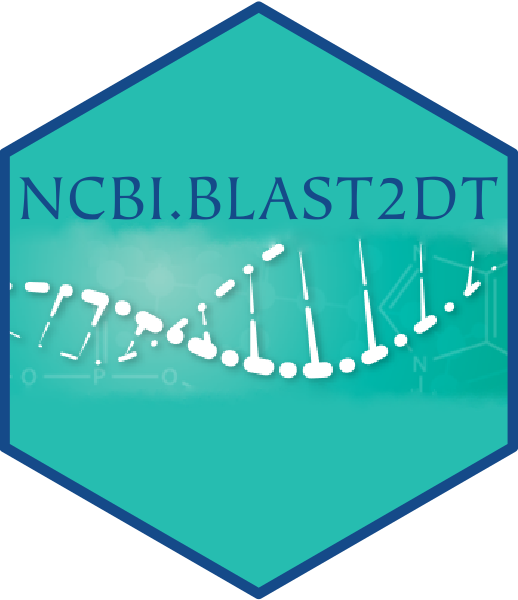

# NCBI.BLAST2DT - Submit DNA sequences to NCBI BLAST and get results in an R data.table. 


  

_**NCBI.BLAST2DT** is an R package allowing you to submit DNA sequences to NCBI BLAST servers directly from the console, to retrieve potential hits on a genome or sequence database, and to collect all results within an R data.table._  
_It makes use of the R package hoardeR to submit sequences to the NCBI BLAST API, and then parses the XML BLAST results returned to load them as an R data.table to make it more easy to query, sort, order and subset the resulting hits._  

**Author: PAGEAUD Y.<sup>1</sup>**  
**1-** [**DKFZ - Division of Applied Bioinformatics, Germany.**](https://www.dkfz.de/en/applied-bioinformatics/index.php)  

**How to cite:** _Pageaud Y. et al., NCBI.BLAST2DT - Submit DNA sequences to NCBI BLAST and get results in an R data.table._  
  
  
  
  

## Content
NCBI.BLAST2DT provides 2 types of functions:
* `submit_NCBI_BLAST()` and `get.NCBI.BLAST2DT()` to **submit** DNA sequences to NCBI for BLASTing them against a sequence database. Theses functions either take DNA sequences as **character strings**, or **Genbank accession IDs and coordinates of the sequences to extract** from them.
* `NCBI_BLAST_XML2DT()` and `aggregate_NCBI_BLAST_XMLs2DT()` to **load, gather, and order** all your BLAST results from NCBI submissions.  

## Prerequisites
### Install Bioconductor dependencies
In R do:
```R
if (!requireNamespace("BiocManager", quietly = TRUE))
    install.packages("BiocManager")

BiocManager::install(c('bamsignals', 'Biostrings', 'GenomicRanges', 'GenomicTools.fileHandler', 'httr', 'IRanges', 'KernSmooth', 'knitr', 'R.utils', 'RCurl', 'rmarkdown', 'Rsamtools', 'S4Vectors', 'seqinr', 'stringr', 'XML'))
```
### Install CRAN dependencies
```R
inst.pkgs = c('data.table', 'devtools', 'parallel', 'xml2')
install.packages(inst.pkgs)
```

## Installing NCBI.BLAST2DT
In R execute the following command:
```R
devtools::install_github("YoannPa/NCBI.BLAST2DT")
```
## Problems ? / I need help !
For any questions **Not related to bugs or development** please check the section "**Known Issues**" available below. If the issue you experience is not adressed in the known issues you can write me at [y.pageaud@dkfz.de](y.pageaud@dkfz.de).

### Known Issues
**❎ submit_NCBI_BLAST() not responding**  
Sometimes `submit_NCBI_BLAST()` can stop responding, or crash, while expecting a BLAST submission result from NCBI servers. If so:
1. Check the log displayed by the console to identify the submission failing.
2. Stop R execution.
3. Delete manually the last result folder (no XML file should be visible in it) in the result directory.
4. Restart R.
5. Execute again the same command using the function `submit_NCBI_BLAST()`: The sequence for which results have already been generated will be automatically skipped, and submission will restart by the last failed submission.

**⚠ In min(which(seqInfo$seqRID == 0)) : no non-missing arguments to min; returning Inf**
This warning can arise from `submit_NCBI_BLAST()` and `get.NCBI.BLAST2DT()` when NCBI BLAST terminates the request in process. There are different reasons why NCBI BLAST server can terminate your request. To find which reason is invocked you can go to the web interface [**here**](https://blast.ncbi.nlm.nih.gov/Blast.cgi?CMD=GetSaved&RECENT_RESULTS=on) and past the run ID from your logs into the field **"Request ID"**. Here an error message might be displayed, explaining the reason why your request has been terminated (e.g. _CPU usage limit was exceeded. You may need to change your search strategy.[...]_) 

**⚠️ Not getting any hits from the XMLs of submitted sequences when I expect some**  
NCBI database names are not well defined anywhere: it can be tricky to find the right one.
For example, to BLAST sequences against the human genome assembly hg19 version, one must specify `db = "genomic/9606/GCF_000001405.25"` in `submit_NCBI_BLAST()`, which is not an obvious name for a genome database.

## Technical questions / Development / Feature request
If you encounters issues or if a feature you would expect is not available in a NCBI.BLAST2DT function, please check if an existing issue adresses your point [here](https://github.com/YoannPa/NCBI.BLAST2DT/issues/). If not, create a [new issue here](https://github.com/YoannPa/NCBI.BLAST2DT/issues/new).  

## References

1. [_hoardeR: Collect and Retrieve Annotation Data for Various Genomic Data Using Different Webservices._](https://cran.r-project.org/web/packages/hoardeR/index.html)
2. [_Johnson, M. et al. NCBI BLAST: a better web interface. **Nucleic Acids Research 36, W5–W9** (2008)._](https://academic.oup.com/nar/article/36/suppl_2/W5/2505810)
3. [_Paradis E. & Schliep K. 2019. ape 5.0: an environment for modern phylogenetics and evolutionary analyses in R. **Bioinformatics 35: 526–528.** doi:10.1093/bioinformatics/bty633. HAL: ird-01920132._](https://academic.oup.com/bioinformatics/article/35/3/526/5055127)
4. [_xml2: Parse XML._](https://cran.r-project.org/web/packages/xml2/index.html)

