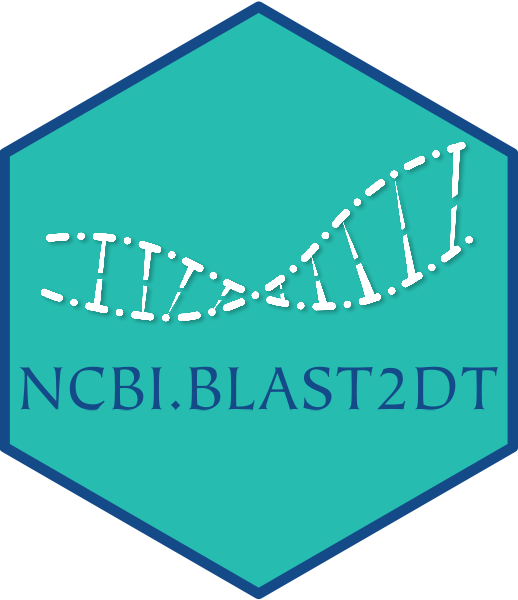

# NCBI.BLAST2DT - Submit DNA sequences to NCBI BLAST and get results in an R data.table. 
_**NCBI.BLAST2DT** is an R package allowing you to submit DNA sequences to NCBI BLAST servers directly from the console, to retrieve potential hits on a genome or sequence database, and to collect all results within an R data.table._  
_It makes use of the R package hoardeR to submit sequences to the NCBI BLAST API, and then parses the XML BLAST results returned to load them as an R data.table to make it more easy to query, sort, order and subset the resulting hits._  

**Author: PAGEAUD Y.<sup>1</sup>**  
**1-** [**DKFZ - Division of Applied Bioinformatics, Germany.**](https://www.dkfz.de/en/applied-bioinformatics/index.php)  

**Version: 0.0.9 (Beta)**  
**R Compatibility: Version 4.0.2**  
**Last Update: 16/08/2021**  
**How to cite:** _Pageaud Y. et al., NCBI.BLAST2DT - Submit DNA sequences to NCBI BLAST and get results in an R data.table._  

## Content
NCBI.BLAST2DT provides 2 types of functions:
* `submit_NCBI_BLAST()` and `get.NCBI.BLAST2DT()` to submit DNA sequences to NCBI for BLASTing them against a sequence database.  
* `NCBI_BLAST_XML2DT()` and `aggregate_NCBI_BLAST_XMLs2DT()` to load, gather, and order all your BLAST results from NCBI submissions.  

## Prerequisites
### Install Bioconductor dependencies
In R do:
```R
if (!requireNamespace("BiocManager", quietly = TRUE))
    install.packages("BiocManager")

BiocManager::install(c('bamsignals', 'Biostrings', 'GenomicRanges', 'GenomicTools.fileHandler', 'httr', 'IRanges', 'KernSmooth', 'knitr', 'R.utils', 'RCurl', 'rmarkdown', 'Rsamtools', 'S4Vectors', 'seqinr', 'stringr', 'XML'))
```
### Install CRAN dependencies
```R
inst.pkgs = c('data.table', 'devtools', 'parallel', 'xml2')
install.packages(inst.pkgs)
```

## Installing
1. In the Git repository click on "Clone or Download".
2. Copy the HTTPS link.
3. Open a terminal and type:
```bash
git clone https://github.com/YoannPa/NCBI.BLAST2DT.git
```
4. Open the folder NCBI.BLAST2DT and open the "NCBI.BLAST2DT.Rproj" file in RStudio.
5. In the RStudio console, type:
```R
devtools::install()
```

## Problems ? / I need help !
For any questions **Not related to bugs or development** please check the section "**Known Issues**" available below. If the issue you experience is not adressed in the known issues you can write me at [y.pageaud@dkfz.de](y.pageaud@dkfz.de).

### Known Issues
**❎ submit_NCBI_BLAST() not responding**  
Sometimes `submit_NCBI_BLAST()` can stop responding, or crash, while expecting a BLAST submission result from NCBI servers. If so:
1. Check the log displayed by the console to identify the submission failing.
2. Stop R execution.
3. Delete manually the last result folder (no XML file should be visible in it) in the result directory.
4. Restart R.
5. Execute again the same command using the function `submit_NCBI_BLAST()`: The sequence for which results have already been generated will be automatically skipped, and submission will restart by the last failed submission.

**⚠️ Not getting any hits from the XMLs of submitted sequences when I expect some**  
NCBI database names are not well defined anywhere: it can be tricky to find the right one.
For example, to BLAST sequences against the human genome assembly hg19 version, one must specify `db = "genomic/9606/GCF_000001405.25"` in `submit_NCBI_BLAST()`, which is not an obvious name for a genome database.

## Technical questions / Development / Feature request
If you encounters issues or if a feature you would expect is not available in a NCBI.BLAST2DT function, please check if an existing issue adresses your point [here](https://github.com/YoannPa/NCBI.BLAST2DT/issues/). If not, create a [new issue here](https://github.com/YoannPa/NCBI.BLAST2DT/issues/new).  

## References
⚠️ **Work in progress !**  

## Licence
The repository BiocompR is currently under the GPL-3.0 licence.  
